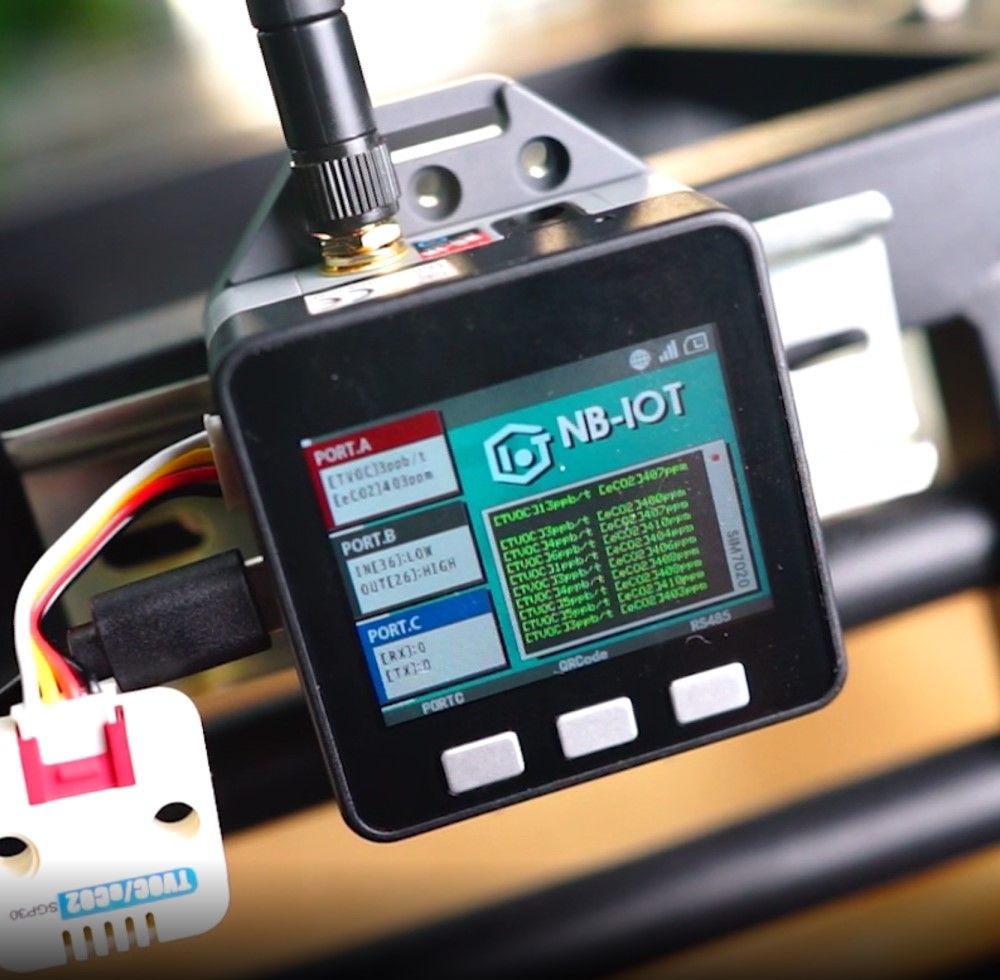

## IoT Base NB FactoryTest

This project is built using PlatformIO, using [M5Stack IoT Base NB](https://docs.m5stack.com/en/base/iot_base_nb_cn) controller suite access [TVOC/eCO2 UNIT(SGP30 Sensor)](https:/ /docs.m5stack.com/en/unit/tvoc), realize MQTT data upload through NBIoT network.

## Related Link

[Docment & Datasheet](https://docs.m5stack.com/en/base/iot_base_nb_cn)

## Required Libraries:

[Adafruit_SGP30](https://github.com/adafruit/Adafruit_SGP30)

## License

[UNIT_ENV - MIT](LICENSE)
